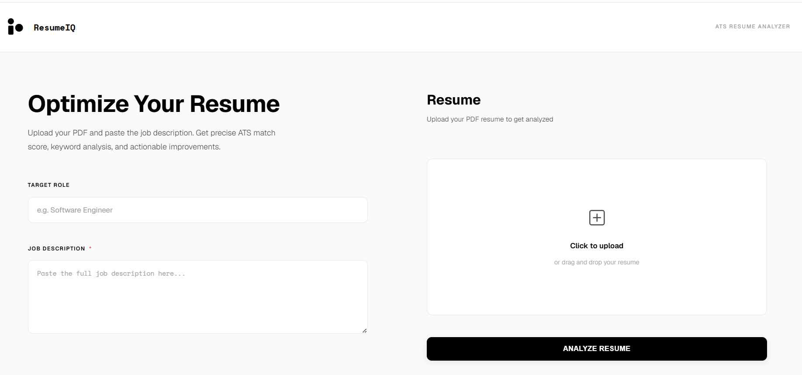
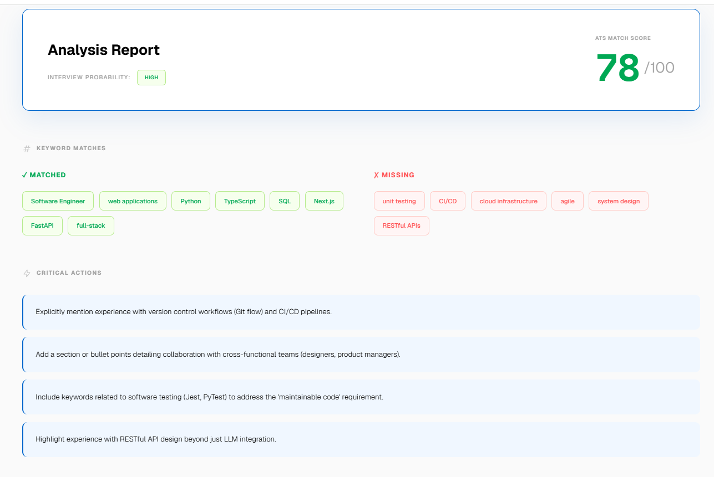
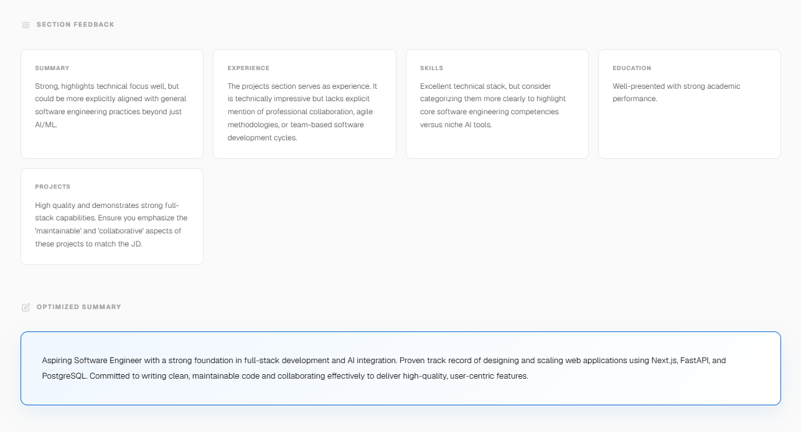
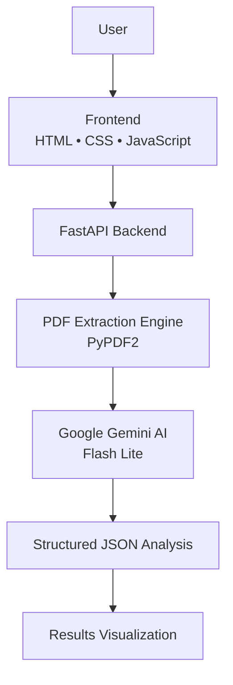
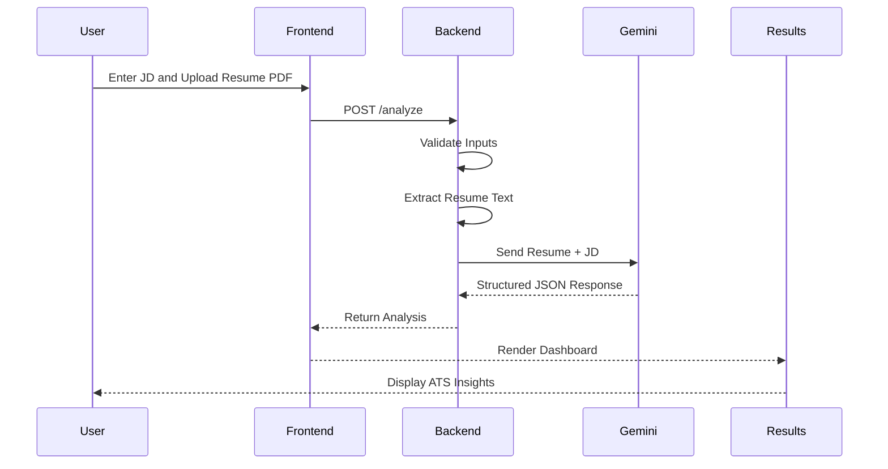
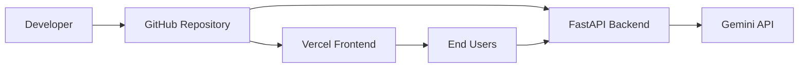

<!-- ========================================================= -->

<!-- ======================= PART 1 =========================== -->

<!-- ========================================================= -->

<a id="top"></a>

<div align="center">

<table>
<tr>
<td align="center" width="90">


</td>

<td align="left">

# ResumeIQ

**AI-Powered ATS Resume Analyzer**

Transform resumes into interview-ready applications using recruiter-grade AI insights.

</td>
</tr>
</table>

<p>
  <a href="https://resumeiq-code-analyzer.vercel.app/">
    
  </a>

  <a href="https://github.com/adithyachary09/ResumeIQ">
    
  </a>

  <a href="https://linkedin.com/in/adithya-chary">
    
  </a>
</p>


</div>

---

## Overview

ResumeIQ is an intelligent resume analysis platform designed to bridge the gap between talented candidates and modern Applicant Tracking Systems (ATS). By combining PDF parsing, Google's Gemini AI, and recruiter-inspired evaluation strategies, it transforms a static resume into actionable career guidance.

Unlike traditional keyword scanners, ResumeIQ doesn't simply count terms—it evaluates alignment, highlights strengths, identifies weaknesses, estimates interview potential, and recommends meaningful improvements tailored to a specific job description.

In a hiring landscape dominated by automated screening, ResumeIQ empowers candidates to understand **why** their resumes succeed or fail and how to improve them before applying.

---

## Highlights

* ⚡ Recruiter-style ATS analysis powered by Gemini AI
* 📄 PDF resume parsing with intelligent text extraction
* 🎯 Job description matching with compatibility scoring
* 🔍 Missing keyword detection for ATS optimization
* 📈 Interview probability estimation
* 🧠 AI-generated professional summary rewriting
* 📱 Fully responsive experience across devices

---

## Application Preview

### Landing Experience

<p align="center">

</p>

<p align="center">
<sub>
Clean and intuitive interface designed to help candidates begin resume evaluation within seconds.
</sub>
</p>

---

### AI Analysis Dashboard

<p align="center">

</p>

<p align="center">
<sub>
ATS scores, recruiter insights, keyword matching, and improvement recommendations.
</sub>
</p>

<br>

<p align="center">

</p>

<p align="center">
<sub>
Structured feedback including optimized summaries and interview readiness insights.
</sub>
</p>

---

## Recruiter Snapshot

### What This Project Demonstrates

* Designing AI products around real-world user pain points
* Building production-ready FastAPI applications
* Integrating Generative AI into practical workflows
* Implementing secure file upload pipelines
* Structuring reliable JSON-based AI outputs
* Creating polished responsive user experiences
* Deploying end-to-end web applications

> *"ResumeIQ doesn't just score resumes—it teaches candidates how to compete more effectively in today's AI-driven hiring process."*

---

## Core Features

### ATS Compatibility Analysis

Evaluate resumes against job descriptions and generate an overall compatibility score that mirrors modern ATS screening behavior.

---

### Keyword Intelligence

Identify which keywords align with the target role and uncover critical terms missing from the resume.

---

### Recruiter-Style Feedback

Receive section-wise insights covering summaries, experience, skills, projects, and education.

---

### AI Summary Optimization

Generate stronger professional summaries tailored to the intended position.

---

### Interview Probability Estimation

Assess the likelihood of progressing through early hiring stages using contextual analysis.

---

### Instant Results Dashboard

Present actionable recommendations through an intuitive and visually engaging interface.

---

<!-- ========================================================= -->

<!-- ======================= PART 2 =========================== -->

<!-- ========================================================= -->

## Architecture

ResumeIQ follows a lightweight yet scalable architecture that combines a responsive frontend, a high-performance FastAPI backend, intelligent PDF processing, and Gemini-powered analysis.



### Architecture Highlights

* Separation of frontend and backend responsibilities
* Lightweight frontend without heavy frameworks
* Structured AI outputs using JSON contracts
* Modular backend components for maintainability
* Scalable API-driven communication

---

## Workflow Diagram

The following sequence illustrates the complete user journey from upload to recruiter-grade analysis.



---

## Tech Stack

| Category             | Technologies                                       |
| -------------------- | -------------------------------------------------- |
| **Frontend**         | HTML5, CSS3, Vanilla JavaScript, Responsive Design |
| **Backend**          | Python, FastAPI, Uvicorn                           |
| **AI / Core Engine** | Google Gemini API, Gemini Flash Lite               |
| **PDF Processing**   | PyPDF2                                             |
| **Validation**       | Pydantic                                           |
| **Communication**    | REST APIs, Multipart Form Upload                   |
| **Deployment**       | Vercel (Frontend), FastAPI Backend                 |
| **Fonts & UI**       | Geist, Space Mono                                  |
| **Version Control**  | Git, GitHub                                        |

---

## Why This Stack?

### FastAPI

Chosen for its speed, developer productivity, automatic validation, and excellent API performance.

---

### Gemini Flash Lite

Selected to deliver fast, cost-efficient, recruiter-style analysis with low latency.

---

### Vanilla JavaScript

Provides a lightweight experience without introducing unnecessary frontend complexity.

---

### PyPDF2

Enables efficient extraction of textual information directly from uploaded PDF resumes.

---

### Pydantic

Ensures robust schema enforcement and predictable backend behavior.

---

## Deployment Overview

ResumeIQ is designed to be simple to deploy while maintaining clear separation between presentation and intelligence layers.



---

## Deployment Pipeline

### Frontend

* Hosted on Vercel
* Globally distributed through edge infrastructure
* Instant updates through GitHub integration

---

### Backend

* FastAPI serves analysis endpoints
* Handles validation and PDF extraction
* Communicates securely with Gemini

---

### AI Layer

* Receives structured prompts
* Produces recruiter-style JSON responses
* Enables consistent downstream rendering

---

## Reliability & Safeguards

ResumeIQ incorporates defensive checks throughout the analysis pipeline.

### Input Validation

* PDF-only uploads
* Maximum file size restrictions
* Minimum job description requirements

---

### Error Handling

* Invalid resume formats
* Failed PDF extraction
* Malformed AI responses
* Gemini service interruptions
* User-friendly frontend messages

---

### Performance Optimizations

* Lightweight frontend rendering
* FastAPI asynchronous processing
* Gemini Flash Lite inference
* Pydantic schema validation
* Dynamic UI updates without page reloads

---

## Technical Impact

ResumeIQ demonstrates how modern Generative AI can be integrated into production-ready applications through thoughtful architecture, structured outputs, and user-centric design—delivering meaningful insights within seconds rather than overwhelming users with raw data.


<!-- ========================================================= -->

<!-- ======================= PART 3 =========================== -->

<!-- ========================================================= -->

## Getting Started

Get ResumeIQ running locally in under **5 minutes**.

### Prerequisites

* Python 3.10+
* Git
* Google Gemini API Key

---

### Installation

```bash
git clone https://github.com/adithyachary09/ResumeIQ.git

cd ResumeIQ

pip install -r requirements.txt
```

---

### Environment Variables

Create a `.env` file:

```env
GEMINI_API_KEY=your_gemini_api_key
```

---

### Running Locally

```bash
python main.py
```

Open:

```text
http://localhost:8000
```

---

## Usage

1. Enter the target role *(optional)*.
2. Paste the job description.
3. Upload a PDF resume.
4. Click **Analyze Resume**.
5. Review ATS insights and recommendations.

---

## Project Structure

```text
ResumeIQ/
├── assets/
│   ├── landing.png
│   ├── results.1.png
│   └── results.2.png
├── analyzer.py
├── resume_parser.py
├── main.py
├── index.html
├── logo.jpg
├── requirements.txt
├── .env.example
└── README.md
```

---

## Development Workflow

```text
Modify Frontend
      ↓
Test Resume Upload
      ↓
Validate Backend APIs
      ↓
Verify Gemini Responses
      ↓
Review Dashboard Output
      ↓
Commit & Deploy
```

---

## Local Development Checklist

* [ ] Configure Gemini API key
* [ ] Install dependencies
* [ ] Start the FastAPI server
* [ ] Upload a sample resume
* [ ] Verify analysis results
* [ ] Commit tested changes

---

## API Endpoints

| Method | Endpoint    | Purpose           |
| ------ | ----------- | ----------------- |
| GET    | `/`         | Serve frontend    |
| GET    | `/health`   | Health monitoring |
| GET    | `/logo.jpg` | Branding asset    |
| POST   | `/analyze`  | Resume analysis   |

---

## Supported Inputs

### Resume

* PDF only
* Maximum size: **5 MB**

### Job Description

* Minimum length: **100 characters**

---

## Typical User Journey

```text
Upload Resume
     ↓
Paste Job Description
     ↓
Analyze with Gemini
     ↓
Review ATS Score
     ↓
Improve Resume
     ↓
Apply with Confidence
```

<!-- ========================================================= -->

<!-- ======================= PART 4 =========================== -->

<!-- ========================================================= -->

## Future Roadmap

ResumeIQ is built with extensibility in mind. Planned enhancements include:

* [ ] DOCX resume support
* [ ] OCR for scanned/image-based resumes
* [ ] Downloadable PDF reports
* [ ] Resume analysis history
* [ ] Multiple resume comparisons
* [ ] Industry-specific optimization modes
* [ ] Cover letter generation
* [ ] Resume templates and suggestions
* [ ] Multi-language support
* [ ] User authentication and profiles

---

## Skills Demonstrated

### Software Engineering

* REST API design
* Modular architecture
* Error handling
* Input validation
* Production-ready workflows

### Backend Development

* FastAPI
* Python
* Pydantic
* API integration
* File processing

### Frontend Development

* HTML5
* CSS3
* Vanilla JavaScript
* Responsive design
* Dynamic rendering

### AI / Generative AI

* Prompt engineering
* Gemini API integration
* Structured JSON generation
* Recruiter-style evaluation systems
* AI-assisted decision support

### DevOps & Deployment

* Git & GitHub
* Vercel deployment
* Environment management
* Monitoring endpoints
* Release workflows

### Product Thinking

* Solving a real-world hiring problem
* User-centric design
* Actionable recommendations
* Fast feedback loops
* Balancing usability with intelligence

---

## Contributions

Contributions, ideas, and improvements are always welcome.

If you'd like to enhance ResumeIQ:

1. Fork the repository
2. Create a feature branch
3. Commit your changes
4. Open a Pull Request

Every contribution—big or small—helps make ResumeIQ more valuable for job seekers.

---

## Connect With Me

<div align="center">

<a href="https://linkedin.com/in/adithya-chary">
  
</a>

<a href="https://github.com/adithyachary09">
  
</a>

<a href="https://resumeiq-code-analyzer.vercel.app/">
  
</a>

</div>

---

## Support the Project

If you found ResumeIQ useful or insightful, consider supporting the project by:

⭐ Starring the repository

🐞 Reporting bugs or issues

💡 Sharing ideas and feature requests

🔁 Sharing the project with others

🤝 Contributing improvements

Your support helps improve the experience for future job seekers and contributors.

---

<div align="center">

## ResumeIQ

### *Helping candidates turn resumes into opportunities.*

<br>

Built with ❤️ by **Adithya**

<br><br>

<a href="#top">
  ↑ Back to Top
</a>

</div>

<!-- ========================================================= -->

<!-- ====================== END README ======================== -->

<!-- ========================================================= -->


